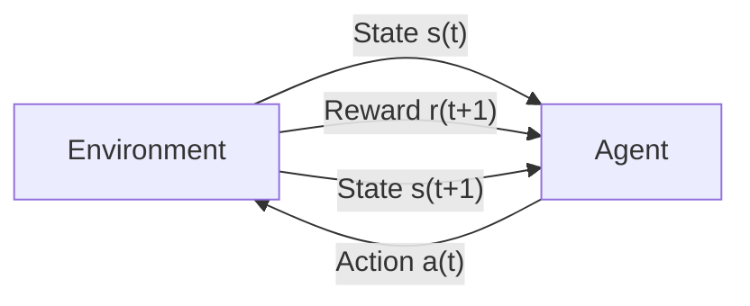
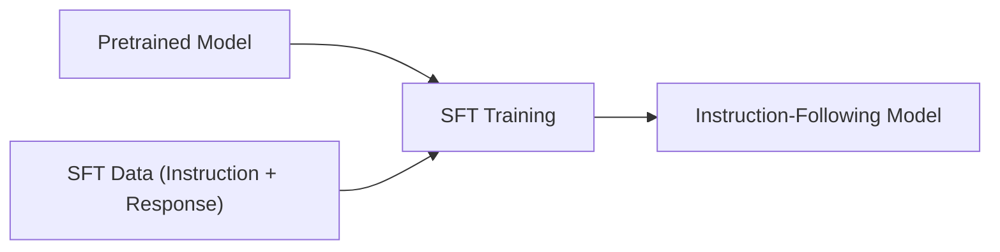
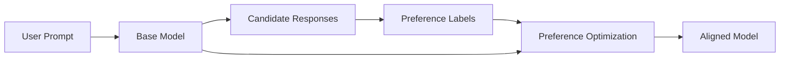
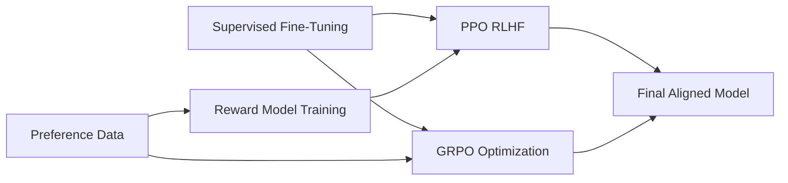
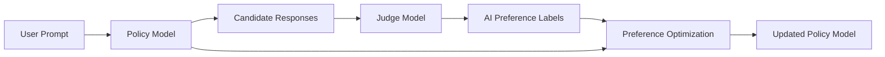
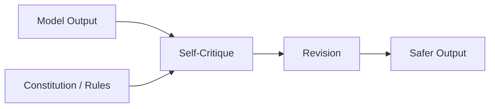
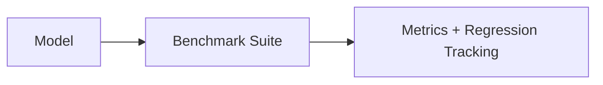
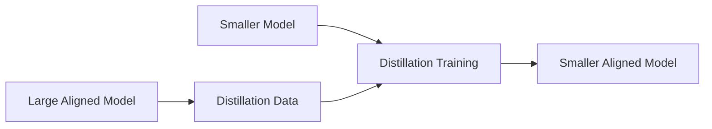

# Post-training Methods for LLMs

This repo collects post-training methods for Large Language Models (LLMs) with
small, focused implementations and runnable examples. The goal is to make
alignment and reinforcement post-training practical, understandable, and
reproducible.

## Scope

- Post-training methods that start from a pretrained model.
- Minimal, readable implementations over full-scale training stacks.
- RL fundamentals in Gymnasium to build intuition for later LLM alignment.

## Quickstart

```bash
python3 -m venv .venv
. .venv/bin/activate
python -m pip install -U pip
pip install -r requirements.txt
```

## Repository Layout

- `gymnasium/`: RL foundations (CartPole examples).
- `requirements.txt`: Python dependencies.
- `README.md`: learning path and run instructions.

## Current Examples

### Gymnasium: CartPole Random Policy

Runs a single random rollout to verify environment setup.

Code: [gymnasium/cartpole_random.py](gymnasium/cartpole_random.py)

```bash
python gymnasium/cartpole_random.py
```

### Gymnasium: CartPole Q-Learning

Trains a discretized Q-learning agent and evaluates it.

Code: [gymnasium/cartpole_q_learning.py](gymnasium/cartpole_q_learning.py)

```bash
python gymnasium/cartpole_q_learning.py
```

Evaluation renders by default.

## Learning Path (Planned)

Each step builds on the previous one; diagrams show simplified dataflow.

### 1) Reinforcement Learning Foundations

Topics:
- Value-based RL (Q-learning, intuition and DQN basics)
- Exploration vs exploitation
- Why policy optimization is needed
- Where classical RL begins to fail for LLMs

Diagram:


### 2) Supervised Fine-tuning (SFT) / Instruction Tuning

Topics:
- Dataset formatting (prompt/response pairs)
- Loss functions (cross-entropy)
- Establishing evaluation baselines
- Makes pretrained models follow instructions

Diagram:


### 3) Preference Optimization (No-RL Alignment)

Includes:
- DPO
- IPO
- KTO
- ORPO

Focus:
- Align models directly using preference pairs
- Often cheaper and more stable than PPO

Diagram:


### 4) Reward Modeling + RLHF (PPO / GRPO Variants)

Coverage:
- Reward model training from preference data
- PPO-based RLHF
- GRPO-style policy optimization (often reducing explicit reward models)
- Why RL can still help (reasoning, safety shaping, controllability)

Diagram:


### 5) RLAIF (AI-Generated Preferences)

- Replaces human labels with LLM judgement
- Enables preference optimization at scale
- Reduces dependence on human annotators

Diagram:


### 6) Constitutional and Safety Tuning

- Constitutional AI foundations
- Self-critique loops guided by a ruleset
- Safety layered across the pipeline

Diagram:


### 7) Evaluation and Comparison Harnesses

- Standardized evaluation harnesses
- Benchmark frameworks
- Reasoning, helpfulness, and safety scoring

Diagram:


### 8) Distillation and Post-training Compression

- Alignment-preserving distillation
- Smaller, deployable aligned models
- Practical deployment-focused tradeoffs

Diagram:

