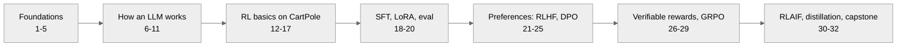

# Post-training Methods for LLMs

This repo collects post-training methods for Large Language Models (LLMs) with
small, focused implementations and runnable examples. The goal is to make
alignment and reinforcement post-training practical, understandable, and
reproducible.

## Scope

- Post-training methods that start from a pretrained model.
- Minimal, readable implementations over full-scale training stacks.
- RL fundamentals in Gymnasium to build intuition for later LLM alignment.
- A step-by-step blog series, from tensors to GRPO (see Learning Path).

## Quickstart

```bash
python3 -m venv .venv
. .venv/bin/activate
python -m pip install -U pip
pip install -r requirements.txt
```

## Tests

```bash
python -m pytest tests/ -v
```

## Repository Layout

- `gymnasium/`: RL foundations (CartPole examples).
- `chess/`: Toy chess Q-learning (KQ vs K).
- `tests/`: unit and smoke tests (pytest).
- `blog/`: blog post drafts for the learning series.
- `requirements.txt`: Python dependencies.
- `README.md`: learning path and run instructions.

## Current Examples

### Gymnasium: CartPole Random Policy

Runs a single random rollout to verify environment setup.

Code: [gymnasium/cartpole_random.py](gymnasium/cartpole_random.py)

```bash
python gymnasium/cartpole_random.py
```

### Gymnasium: CartPole Q-Learning

Trains a discretized Q-learning agent and evaluates it.

Code: [gymnasium/cartpole_q_learning.py](gymnasium/cartpole_q_learning.py)

```bash
python gymnasium/cartpole_q_learning.py
```

Evaluation renders by default.

### Gymnasium: CartPole DQN

Trains a deep Q-network with replay and a target network.

Code: [gymnasium/cartpole_dqn.py](gymnasium/cartpole_dqn.py)

```bash
python gymnasium/cartpole_dqn.py
```

Evaluation renders by default.

### Gymnasium: CartPole PPO

Trains an actor-critic with the PPO clipped objective and GAE.

Code: [gymnasium/cartpole_ppo.py](gymnasium/cartpole_ppo.py)

```bash
python gymnasium/cartpole_ppo.py
```

Evaluation renders by default.

### Gymnasium: CartPole GRPO

Trains a critic-free policy using group-normalized episode returns as
advantages, the same mechanism GRPO uses for LLM post-training.

Code: [gymnasium/cartpole_grpo.py](gymnasium/cartpole_grpo.py)

```bash
python gymnasium/cartpole_grpo.py
```

Evaluation renders by default.

### Chess: KQ vs K Q-Learning

Trains a Q-learning agent on a toy chess endgame (King + Queen vs King).

Code: [chess/chess_q_learning.py](chess/chess_q_learning.py)

```bash
python chess/chess_q_learning.py
```

## Learning Path: LLM Post-Training from Scratch

A 32-post series that builds up slowly: no post uses a concept that an
earlier post has not taught. Every method is implemented from scratch in
PyTorch first, then with a library (PEFT, TRL).

From post 10 onward, one running project ties the series together: a
Wordle-playing agent that starts as the raw Qwen2.5-0.5B base model. Each
post-training method is applied to the same agent, and every post reports
the same scoreboard (win rate, average guesses, illegal-move rate) on a
fixed set of target words.


```mermaid
%%{init: {'theme': 'neutral'}}%%
flowchart LR
  F["Foundations<br/>1-5"] --> L["How an LLM works<br/>6-11"]
  L --> R["RL basics on CartPole<br/>12-17"]
  R --> S["SFT, LoRA, eval<br/>18-20"]
  S --> P["Preferences: RLHF, DPO<br/>21-25"]
  P --> V["Verifiable rewards, GRPO<br/>26-29"]
  V --> W["RLAIF, distillation, capstone<br/>30-32"]
```

### Foundations

1. Tensors and Matrix Multiplication: The Linear Algebra a Transformer Actually Uses
2. Gradients by Hand, Then by Autograd
3. Probability for Language Models: Softmax, Log-Probs, and Sampling
4. Cross-Entropy, KL Divergence, and Entropy from Scratch
5. Training Loops: AdamW, Learning Rate Schedules, and Reading Loss Curves

### How an LLM works

6. Tokenizers, Special Tokens, and Chat Templates
7. Embeddings, Attention, and the Causal Mask
8. The Transformer Block: Residuals, LayerNorm, MLP, and the Next-Token Loss
9. Pre-Training in Miniature: Training a Tiny Base Model
10. Base Model vs Chat Model: Loading Qwen and Measuring What Post-Training Changes
11. Generating Text: Decoding, the KV Cache, EOS vs Max Length, and Batched Rollouts

### RL basics

12. RL in One Loop: States, Actions, Rewards, Q-Learning, and DQN
13. Monte Carlo Estimates and the Log-Derivative Trick: Why RL Gradients Are Noisy
14. REINFORCE from Scratch, and the Baseline That Tames Variance
15. Actor-Critic: Value Functions, Advantages, GAE, and Importance Sampling
16. Before You Touch an LLM: PPO and GRPO on CartPole
17. From CartPole to Tokens: Text Generation as an RL Problem

### Supervised fine-tuning

18. SFT from Scratch: Instruction Data and Loss Masking on Your Tiny Model
19. LoRA from Scratch, Then with PEFT: Fitting Qwen-0.5B on a Free GPU
20. Evaluating a Fine-Tune: Held-Out Loss, Win Rates, and Regressions

### Preferences

21. Reward Models: Bradley-Terry Loss on Preference Pairs
22. RLHF with PPO: The KL Penalty and the Reference Model
23. Reward Hacking: Watching a Policy Game Its Reward Model
24. DPO from Scratch: Deriving It from the RLHF Objective
25. The DPO Family: IPO, KTO, ORPO, and SimPO on One Dataset

### Verifiable rewards and reasoning

26. RLVR: Verifiers, Best-of-N, and Rejection Sampling on Math Problems
27. GRPO for LLMs from Scratch
28. Building an RL Environment: A Sandboxed Verifier Harness
29. Scaling RL for Reasoning: Response Length, Entropy Collapse, and GRPO Fixes

### Wrap-up

30. RLAIF and Constitutional AI: An LLM Judge as the Labeler
31. Distillation: Teaching a Small Model from a Post-Trained One
32. Capstone: SFT, DPO, and GRPO on One Small Model with One Eval Harness
