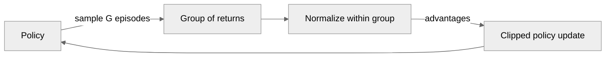

# Before You Touch an LLM: PPO and GRPO on CartPole

This is post 00 of a series that takes one small model — Qwen2.5-0.5B — through the whole post-training pipeline: SFT, reward modeling, DPO, PPO-RLHF, GRPO, RLAIF, constitutional AI, and distillation. Before any of that, we need the reinforcement learning intuition, and the cheapest place to build it is a cart balancing a pole.

## Why start with CartPole for LLM post-training

An LLM generating text *is* a policy. At each step it sees a state (the prompt plus everything it has written so far), samples an action (the next token) from a distribution over its vocabulary, and eventually stops. The whole trajectory gets a score — from a reward model, a human, or a unit test that either passes or doesn't. Then you nudge the network to make high-scoring trajectories more likely.

That is exactly what CartPole is, minus four orders of magnitude. The state is 4 floats (cart position, cart velocity, pole angle, pole angular velocity). The action space is 2 (push left, push right) instead of ~150,000 tokens. The reward is +1 per step the pole stays up, capped at 500.

The algorithms are *the same code*. PPO's clipped objective — the thing that trained InstructGPT and every RLHF model after it — is four lines of PyTorch, and it doesn't care whether the logits came from a 2-layer MLP or a transformer. GRPO, which DeepSeek-R1 used to learn reasoning, is that same objective with the critic deleted. On CartPole you can watch both converge in under five minutes on a laptop CPU. On a 0.5B model you would wait hours to find out you had the sign backwards.

So: learn the mechanism where the feedback loop is fast, then swap the policy.

## The road here

Before PPO there were two simpler agents in this repo, both value-based.

**Q-learning** ([`gymnasium/cartpole_q_learning.py`](../gymnasium/cartpole_q_learning.py)) learns a table $Q(s, a)$ — the expected return of taking action $a$ in state $s$ and behaving well afterwards. You update it toward $r + \gamma \max_{a'} Q(s', a')$ and act greedily. It works on CartPole only after you *discretize* the four continuous state dimensions into bins, and that discretization is the whole ballgame: too coarse and the agent can't see the difference between recoverable and doomed; too fine and the table is mostly empty cells it never visits.

**DQN** ([`gymnasium/cartpole_dqn.py`](../gymnasium/cartpole_dqn.py)) fixes the binning problem by replacing the table with a neural network, and adds the two tricks that make that stable: a replay buffer (so consecutive, correlated transitions don't dominate a gradient step) and a target network (so the thing you regress toward doesn't move every step).

Both share a structural limit. They learn *values*, and derive the policy from them by taking an argmax. That works when there are two actions. It falls apart when the action space is enormous — you cannot argmax over 150,000 tokens' worth of Q-values at every generation step and expect anything sane, and there is no $\max_{a'}$ you can compute cheaply in the bootstrap target. It also produces a deterministic policy, when what we want from a language model is a *distribution* we can sample from.

The fix is to stop learning values as an end in themselves and optimize the policy directly.

## PPO in ~300 lines

Start with the policy gradient. If $\pi_\theta$ is our policy and $A_t$ is the advantage of action $a_t$ (how much better it was than average), the gradient of expected return is:

$$\nabla_\theta J(\theta) = \mathbb{E}\left[\nabla_\theta \log \pi_\theta(a_t \mid s_t)\, A_t\right]$$

Read it as: increase the log-probability of actions that beat the baseline, decrease it for actions that don't, weighted by how much.

This has a brutal practical problem. The expectation is over trajectories from $\pi_\theta$ — the *current* policy. The moment you take one gradient step, your collected data is off-policy and formally useless. Collecting a rollout is the expensive part, and you get one gradient step out of it.

Importance sampling buys the data back. Rewrite the objective as an expectation under the old policy that collected the rollout:

$$L(\theta) = \mathbb{E}_{a \sim \pi_{\text{old}}}\left[\, r_t(\theta)\, A_t \,\right], \qquad r_t(\theta) = \frac{\pi_\theta(a_t \mid s_t)}{\pi_{\text{old}}(a_t \mid s_t)}$$

Now you can take many gradient steps on one rollout. But the correction is only trustworthy while $\pi_\theta$ stays close to $\pi_{\text{old}}$. Maximize $r_t A_t$ without a constraint and, for any action with $A_t > 0$, the optimizer happily drives $r_t \to \infty$ — it pushes that action's probability toward 1 based on a single advantage estimate from stale data. The policy collapses, and because it collapsed it collects garbage rollouts, and there is no recovering.

PPO's answer is almost embarrassingly direct: clip the ratio, and take the pessimistic branch.

$$L^{\text{CLIP}}(\theta) = \mathbb{E}\left[\min\left(r_t A_t,\ \operatorname{clip}(r_t, 1-\epsilon, 1+\epsilon)\, A_t\right)\right]$$

The `min` is doing real work, and it is asymmetric. When $A_t > 0$ and the ratio has already climbed past $1+\epsilon$, the clipped term is smaller, so `min` selects it — a constant, with zero gradient. You stop being rewarded for pushing a good action further than $\epsilon$ past where it started. But when $A_t < 0$ and the ratio has climbed past $1+\epsilon$ — an action that got *more* likely despite being bad — the unclipped term is the more negative one, so `min` selects it and the gradient flows at full strength. The clip caps your enthusiasm; with a negative advantage and the ratio already below $1-\epsilon$, `min` selects the clamped, zero-gradient term, so the clip does stop further down-weighting beyond $\epsilon$ per update.

Here is the whole thing, verbatim from [`gymnasium/cartpole_ppo.py`](../gymnasium/cartpole_ppo.py) (docstrings elided here and in the snippets below):

```python
def ppo_clipped_loss(
    new_logp: torch.Tensor,
    old_logp: torch.Tensor,
    advantages: torch.Tensor,
    clip_coef: float,
) -> torch.Tensor:
    ratios = (new_logp - old_logp).exp()
    unclipped = ratios * advantages
    clipped = torch.clamp(ratios, 1.0 - clip_coef, 1.0 + clip_coef) * advantages
    return -torch.min(unclipped, clipped).mean()
```

Four lines. (The ratio is computed in log-space and exponentiated — `exp(new - old)` — which is both numerically kinder and free, since you already have log-probs.)

That leaves $A_t$. The advantage is "how much better than expected was this action," and *expected* comes from a learned critic $V(s)$. The naive estimate is one-step TD error, $\delta_t = r_t + \gamma V(s_{t+1}) - V(s_t)$: low variance, but it inherits every bias in the critic. The other extreme is the full discounted return: unbiased, but the variance of summing 500 noisy rewards is enormous.

Generalized Advantage Estimation is a dial between them. It takes an exponentially-weighted average of all the $n$-step estimates, controlled by $\lambda$: at $\lambda = 0$ you get pure one-step TD, at $\lambda = 1$ you get the full Monte-Carlo return. We run $\lambda = 0.95$ — mostly Monte-Carlo, with just enough critic smoothing to take the edge off.

```python
def compute_gae(
    rewards: np.ndarray,
    dones: np.ndarray,
    values: np.ndarray,
    next_value: float,
    gamma: float,
    gae_lambda: float,
) -> Tuple[np.ndarray, np.ndarray]:
    advantages = np.zeros_like(rewards, dtype=np.float32)
    last_gae = 0.0
    for t in reversed(range(len(rewards))):
        next_nonterminal = 1.0 - dones[t]
        if t == len(rewards) - 1:
            next_values = next_value
        else:
            next_values = values[t + 1]
        delta = rewards[t] + gamma * next_values * next_nonterminal - values[t]
        last_gae = delta + gamma * gae_lambda * next_nonterminal * last_gae
        advantages[t] = last_gae
    returns = advantages + values
    return advantages, returns
```

The backwards loop is just the recursion $\hat{A}_t = \delta_t + \gamma\lambda\,\hat{A}_{t+1}$, with `next_nonterminal` zeroing the carry at episode boundaries so credit never leaks across a reset.

### What actually happened

Hyperparameters: 200,000 timesteps, rollout 1024, 10 update epochs, minibatch 256, $\gamma = 0.99$, $\lambda = 0.95$, $\epsilon = 0.2$, value coefficient 0.5, entropy coefficient 0.01, grad-norm clip 0.5, lr 3e-4, seed 0. CPU only.

The average return over the last 10 episodes, logged every 10 updates:

| Update | Timesteps | avg_reward |
|---|---|---|
| 10 | 10,240 | 34.1 |
| 30 | 30,720 | 151.3 |
| 40 | 40,960 | 115.7 |
| 100 | 102,400 | 219.1 |
| 140 | 143,360 | 297.9 |
| 180 | 184,320 | 367.7 |
| 190 | 194,560 | 287.6 |

Final average over the last 10 episodes: **397.7**, from returns `[500.0, 313.0, 500.0, 500.0, 99.0, 247.0, 391.0, 500.0, 427.0, 500.0]`. 1,688 episodes total. Training took **78.8 seconds** on CPU; evaluation took 0.2s, for 79.1s end to end.

Greedy evaluation, 5 episodes: **500.0, 500.0, 500.0, 500.0, 500.0**. Perfect.

## GRPO: fire the critic

Look at what the critic is actually for. It exists to answer one question — "how good is this state, on average?" — so we can subtract that baseline and get an advantage. For that privilege PPO pays a value head, a second loss term weighted at 0.5, two extra hyperparameters ($\gamma$ and $\lambda$), the backwards recursion above, and a whole second failure mode where the critic is wrong and quietly poisons every advantage.

GRPO's observation: if you want to know whether an episode was better than average, you can *sample the average*. Roll out a group of $G$ episodes from the same policy, and score each one against its own group:

$$A_i = \frac{R_i - \operatorname{mean}(R_1 \ldots R_G)}{\operatorname{std}(R_1 \ldots R_G) + 10^{-8}}$$

Every step in episode $i$ gets that one number. Verbatim from [`gymnasium/cartpole_grpo.py`](../gymnasium/cartpole_grpo.py):

```python
def compute_group_advantages(returns: np.ndarray) -> np.ndarray:
    mean = returns.mean()
    std = returns.std()
    return (returns - mean) / (std + 1e-8)
```

Three lines replace `compute_gae`, the value head, the value loss, `vf_coef`, `gae_lambda`, and `gamma`. The clipped objective is *imported unchanged* — `from cartpole_ppo import ppo_clipped_loss`. That is the entire algorithmic delta between PPO and GRPO: where the advantages come from.



You pay for this in credit assignment. Every action in a 500-step episode receives the same advantage, so a great episode reinforces its mistakes too. GRPO bets that with enough groups the noise averages out — and for LLM post-training that bet is nearly free, because you usually only *have* a trajectory-level reward anyway. There is no per-token score from a reward model or a passing test suite. The critic was always estimating something you couldn't observe.

### What actually happened

Hyperparameters: 300 iterations, group size 8, 4 update epochs, $\epsilon = 0.2$, lr 1e-3, seed 0. CPU only.

| Iteration | avg_group_return |
|---|---|
| 10 | 24.8 |
| 30 | 99.5 |
| 50 | 311.2 |
| 70 | 461.6 |
| 90 | 491.7 |
| 110 | **500.0** |
| 200 | 500.0 |
| 300 | 500.0 |

A group mean first touched 500.0 around iteration 68. By iteration 110 the 10-iteration average was a flat 500.0, and it held there through iteration 300 with only isolated single-iteration dips (496.2, 492.7, 495.5, 498.7) that recovered immediately. Greedy evaluation: **5/5 episodes at 500.0**.

Training took **244.5 seconds** — noticeably longer than PPO's 78.8s, but the two aren't measuring the same thing. PPO had a fixed 200,000-step budget; GRPO's budget is 300 iterations × 8 *complete* episodes, and episodes get longer as the policy improves, so late in training each iteration is sampling close to 8 × 500 = 4,000 steps. GRPO is simpler, not cheaper.

**No tuning was required.** The first configuration we tried converged.

## The LLM bridge

Everything above transfers directly. The only thing that changes is what the policy network is.

| CartPole | LLM post-training |
|---|---|
| State: 4 floats | Prompt + tokens generated so far |
| Action: push left / right | Next token, sampled from the vocabulary |
| Policy network: 2-layer MLP → 2 logits | Transformer → ~150,000 logits |
| Episode: cart balances until it falls | Completion, until EOS or max length |
| Episode return: +1 per step, capped at 500 | Reward-model score, or a verifiable reward (test passes, answer correct) |
| Group of 8 sampled episodes | Group of $G$ sampled answers to the *same* prompt |
| `compute_group_advantages(returns)` | Same function, same three lines |
| `ppo_clipped_loss(...)` per step | Same function, per token |

The `π_old` in the ratio becomes the model as it was before this batch of updates. Real RLHF adds one thing we don't need here: a KL penalty against the *frozen reference* model, keeping the policy from drifting into degenerate text that games the reward model. CartPole has no equivalent, because there is no "sounding like English" to lose.

## What broke

**PPO's training average never reached 500.** It topped out at 397.7 while greedy evaluation scored a clean 5/5 at 500.0. This looks like a bug and isn't. During training the agent *samples* from the Categorical distribution over actions; at evaluation it takes an `argmax`. A policy that assigns 97% probability to the right action still plays the wrong one every ~33 steps, and on a 500-step balancing task that is enough to drop episodes. The entropy bonus (`ent_coef = 0.01`) is actively paying the policy to keep that residual randomness, because that's what keeps exploration alive. Train-time and eval-time returns measure different policies, and the gap is a feature. There is a second contributor: episodes cut off by the 500-step time limit are treated as terminal (`done = terminated or truncated`), so there is no value bootstrap from $V(s_{\text{next}})$ on those episodes, which biases value targets downward late in training when most episodes are reaching the limit. We kept the simplification for this stage and will handle truncation vs. true termination properly once we reach LLM PPO, where the distinction is real (EOS vs. hitting max generation length).

**The PPO curve is not monotonic.** Update 30 hit 151.3, then update 40 fell to 115.7. Updates 170–190 went 331.2 → 367.7 → 287.6. One of the final ten episodes scored 99.0. This is ordinary on-policy variance — each number is an average over only 10 episodes of a stochastic policy — and none of it indicated instability.

**GRPO's run was clean, and that deserves an explanation rather than a victory lap.** CartPole is a forgiving environment for group-relative methods specifically: the reward is dense (+1 every step), the return is *exactly* the episode length, so the group signal is perfectly informative with no reward-model noise; the horizon is short; and the action space has two entries, so a bad update can't get lost in a high-dimensional policy space. None of those hold when the policy is a language model and the return is a learned reward-model score. Expect the honest failures to arrive in stage 1.

**A practical annoyance worth recording:** both scripts' `main()` builds the evaluation environment with `render_mode="human"`, which is right for watching the cart and wrong for an automated run. Both result sets were produced by a small throwaway driver that imported `train_ppo` / `train_grpo` and evaluated against a non-rendering env, leaving the committed files untouched. If you run these yourself, expect a window to open.

## Next up

Stage 1 swaps the 2-layer MLP for Qwen2.5-0.5B and treats it as this exact policy: state is the prompt, actions are tokens, `ppo_clipped_loss` is unchanged. First we need something worth optimizing — supervised fine-tuning, then a reward model — before any of it can be the $R_i$ in that three-line advantage function.

The algorithms don't get harder from here. The environment does.
